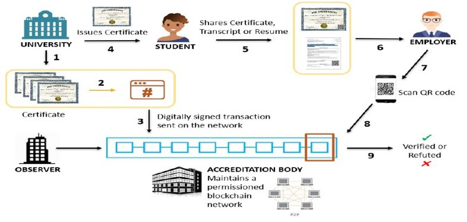
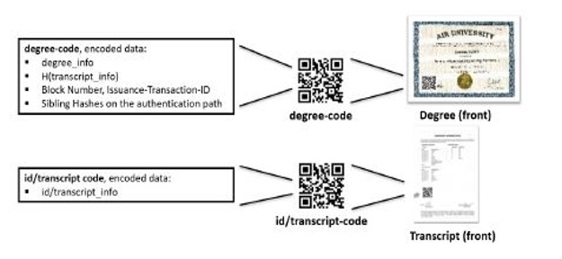

[![LinkedIn][linkedin-shield]][linkedin-url]

## Degree Verification using Ethereum

## Background

In recent years, the blockchain has been promoted as a promising new technology for transparency and data integrity in a variety of domains, including payment settlements, copyright protection, data notarization, digital government, health care, logistics and tracking, and secure elections  

## Proposed Solution

## Preparing Credentials

Whats inside the QR-Code

## Setup this project
 1. Node Js
 2. Truffle (Used to intract Ganache)
 3. Ganache (Local / Private blockchain Quickly fire up a personal Ethereum blockchain which you can use to run tests, execute commands, and inspect state while controlling how the chain operates.)
 4. MetaMask (A crypto wallet & gateway to blockchain apps, used to pay Gas Fee for contract transection)
 5. MetaMask Legacy Web3 (Chrome extension to deal with legacy web3 functions)
 6. Visual Studio Code (Code Editor)

 
## Contributers:
University: Information Technology University
1. Muhammad Taimur Adil (MSDS19040)
2. Jawwad Tariq (MSDS19038)
3. Mukarram Ahmad (MSDS19054)
4. Abdullah Riaz (MSDS19090)
