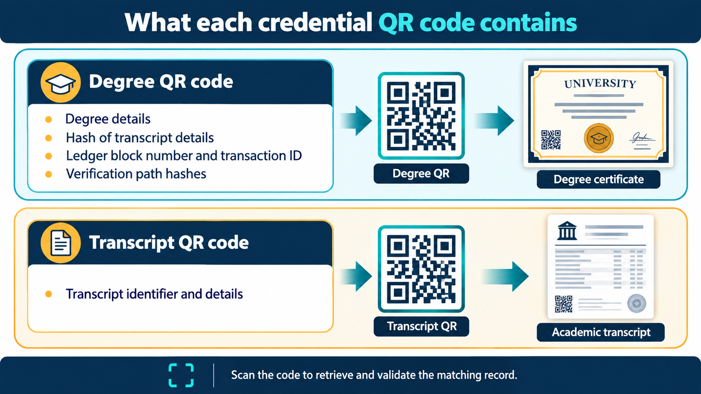

# Degree Verification Using Ethereum

This project explores how Ethereum can help verify academic credentials. A university issues a credential and records verification data on a blockchain. An employer can then use the credential’s QR code to check the recorded data and determine whether the credential is valid.

## Background

Academic certificates can be difficult to verify when the issuing institution must respond to every request. A blockchain provides a shared, tamper-evident record that can support independent verification. The certificate itself does not need to be stored on-chain; a fingerprint of its data can be recorded instead.

## Proposed Solution

The university issues a signed credential and records its fingerprint on the blockchain. The graduate shares the credential with an employer, who scans its QR code to retrieve the information needed for verification.

## Preparing Credentials

QR codes connect the degree and transcript to their verification data. The degree code contains degree details, a hash of the transcript details, and information used to locate and verify the blockchain record. The transcript code contains its identifier and details.

## Development Setup

Install the following tools to run the project locally:

1. **Node.js** — runs the project’s JavaScript tooling.
2. **Truffle** — compiles, deploys, and tests the smart contracts.
3. **Ganache** — provides a local Ethereum blockchain for development and testing.
4. **MetaMask** — connects a browser wallet to Ganache and submits transactions.
5. **MetaMask Legacy Web3** — supports legacy Web3 calls used by this project.
6. **Visual Studio Code** — optional code editor.

> MetaMask Legacy Web3 is included because this project uses legacy Web3 functions. A newer implementation should replace that dependency.

## Contributors

**University:** Information Technology University

- Muhammad Taimur Adil (MSDS19040)
- Jawwad Tariq (MSDS19038)
- Mukarram Ahmad (MSDS19054)
- Abdullah Riaz (MSDS19090)
